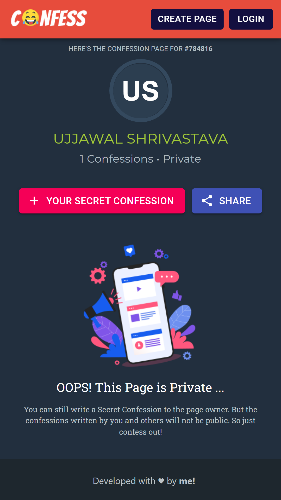

<h2 align="center"><b>Confess</b></h2>

<h4 align="center">Create confession pages and share with your friends!</h4>

 

 

## Screenshots

 

## Description

With this project, you can make a confession page that you can share with anyone. Anyone can visit the page and submit anonymous confessions using the provided link. The authenticated user can then view all submissions, like them, or delete them. Pages can be set to be either public or private. Making the page public allows anyone to view all submissions.

### Stack
- [Create React App](https://create-react-app.dev/)
- [Typescript](https://www.typescriptlang.org/)
- [Apollo Client](https://www.apollographql.com/docs/react/)

This project makes use of a GraphQL API written in Django. The backend repo can be found [here]().

_This project was created at a very early stage when I was still experimenting with full-stack development with React and GraphQL. This is an advanced TODO app that was created with the sole purpose of learning the technology and frameworks._

_At the time of writing this README, I had gained a lot more experience with this stack and can see significant improvements that can be made. However, due to time constraints, I will not be able to continue working on this project._

 

## Features
- No signup needed for writing confessions
- Public/Private Pages
- Likes
- Block/Remove absurd confessions
- Anonymous Confessions

 

## Contributing

Want to contribute/fix few things? Check [CONTRIBUTING.md](./CONTRIBUTING.md).

 

## License

Confess is Free Software: You can use, study share and improve it at your
will. Specifically you can redistribute and/or modify it under the terms of the
[GNU General Public License](https://www.gnu.org/licenses/gpl.html) as
published by the Free Software Foundation, either version 3 of the License, or
(at your option) any later version.
